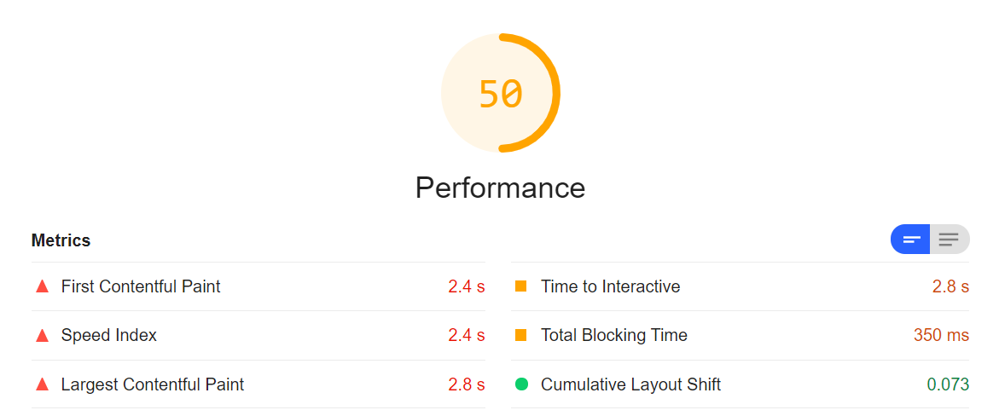
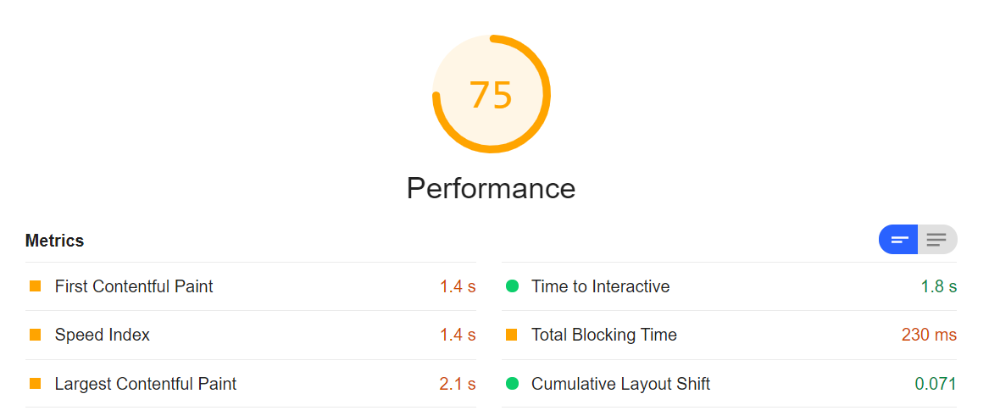
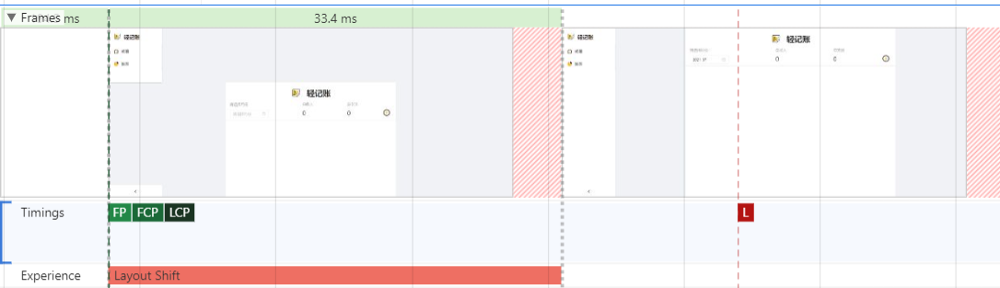
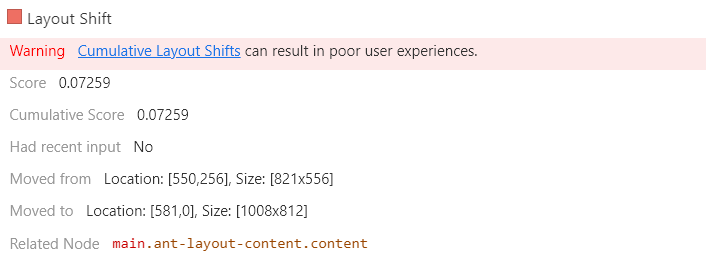
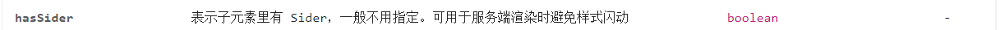

# 在线记账系统


#### 项目地址：https://lite-ledger.web.cloudendpoint.cn/

#### 项目结构:

```text
├─components
│  ├─icon
│  │      Icon.css
│  │      Icon.tsx
│  │      
│  ├─localDatePicker
│  │      LoaclDatePicker.css
│  │      LocalDatePicker.tsx
│  │      
│  ├─logo
│  │      Logo.css
│  │      Logo.tsx
│  │      
│  ├─mainLayout
│  │      MainLayout.css
│  │      MainLayout.tsx
│  │      
│  └─provider
│      │  Provider.tsx
│      │  
│      └─reducer
│              action.ts
│              asyncActions.ts
│              reducer.ts
│              useCustomizedReducer.ts
│              
├─pages
│  ├─chart
│  │  │  ChartPage.css
│  │  │  ChartPage.tsx
│  │  │  
│  │  └─components
│  │      ├─linechart
│  │      │      lineChartInMonth.tsx
│  │      │      
│  │      └─piechart
│  │              pieChartInMonth.tsx
│  │              
│  └─detail
│      │  DetailPage.css
│      │  DetailPage.tsx
│      │  
│      └─components
│          ├─dailyRecord
│          │      DailyRecords.css
│          │      DailyRecords.tsx
│          │      
│          ├─record
│          │      Record.css
│          │      Record.tsx
│          │      
│          └─recordModal
│                  RecordModal.css
│                  RecordModal.tsx
│                  
└─services
    │  client.ts
    │  dateHelper.ts
    │  recordHelpler.ts
    │  router.tsx
    │  
    └─iconSelector
            iconSelector.ts
```

#### 优化之路

1. 输入框数据类型

&emsp;&emsp;在新建账单的输入框把金额减到零，发现控制台`warning`：`The specified value “NaN” cannot be parsed, or is out of range`。发现是输入框解析undefined异常的问题，遂把记录价格的`price`属性改成`string`类型，解决了问题。


2. First Contentful Paint

   使用Lighthouse生成性能报告，发现FCP很高



&emsp;&emsp;遂采取其提供的建议"If you are not server-side rendering, [split your JavaScript bundles](https://web.dev/code-splitting-suspense/?utm_source=lighthouse&utm_medium=devtools) with `React.lazy()`. Otherwise, code-split using a third-party library such as [loadable-components](https://www.smooth-code.com/open-source/loadable-components/docs/getting-started/)."，依据官方文档对`antd`进行了按需加载优化，并使用`React.lazy()`让图表分页懒加载，达到了一定的优化效果:




3. Layout Shift

&emsp;&emsp;每次刷新页面，都能感到有什么东西闪了一下，遂用perfomance录制页面加载过程并分析，发现页面存在一个虽然只有33.4ms，但是看起来很明显的Layout Shift：




相关元素:


&emsp;&emsp;起初以为是content的高度问题，经查找发现并不是，后通过改变各种CSS属性并观察效果，确信应该是渲染过程中Sider的宽度被Content无视了，因为项目布局是采用了antd的Layout组件，于是我仔细查看antd的Layout文档，这才发现有个提示：



遂给Layout加了个属性`hasSider = {true}`，问题就这么解决了。这个问题不像应该官方文档说的这样，只有服务端渲染才会出现。

